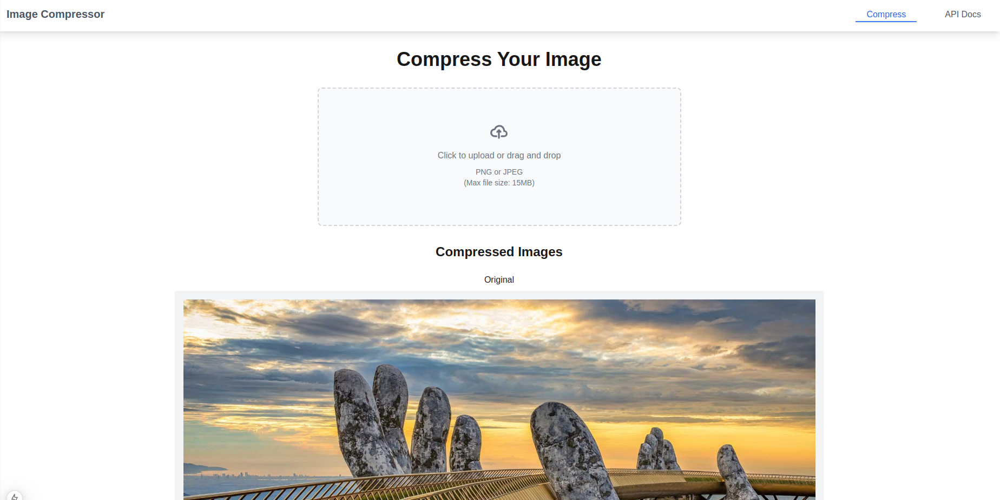
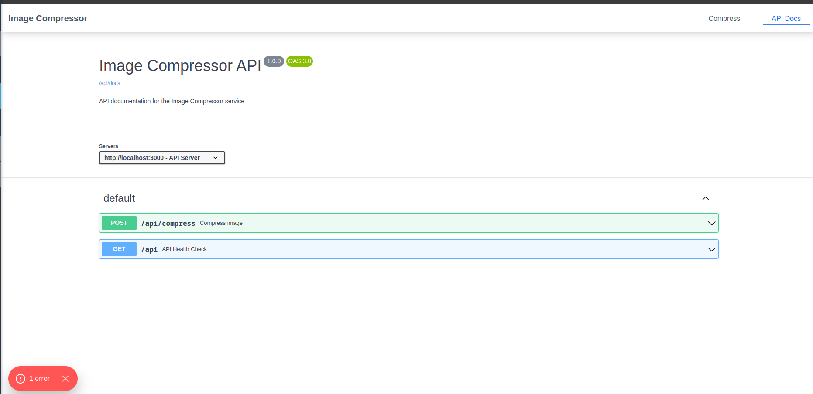
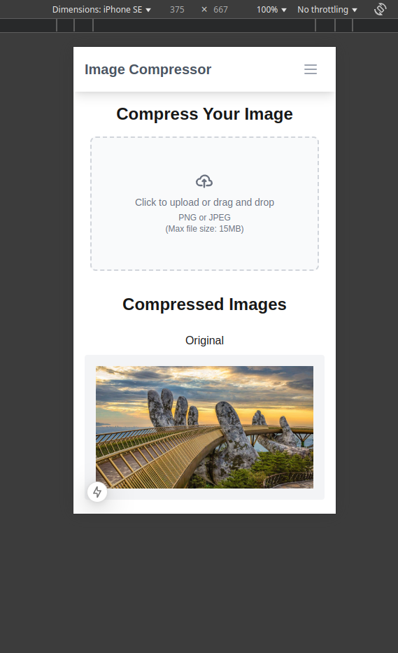

# Image-Compressor

[](https://github.com/Rubber-Duck-999/Image-Compressor/actions/workflows/build.yml)


This is a [Next.js](https://nextjs.org) project bootstrapped with [`create-next-app`](https://nextjs.org/docs/app/api-reference/cli/create-next-app).

Built to show a working example stack for managing user images and compressing them.

## Getting Started

First, install the node modules:

```bash
yarn install
```

Then run the local server:
```bash
yarn run dev
```

## Docker

```bash
docker build -t image-compressor .
docker run -p 3000:3000 image-compressor
```

Could have used docker compose

Added container into the packages

## Guides used

- https://tailwindcss.com/docs/
  - First time used so I looked up every keyword, took a while
- https://flowbite.com/docs/components/tabs/
- https://www.duplichecker.com/image-compressor.php
  - Followed someone elses basic website for features that I may have missed
- https://nextjs.org/docs/app/getting-started/layouts-and-pages
  - First time again using this, used the template then tried to follow their section on apis, and pages
  - Was confused by each page file being called page.tsx at first
- https://www.npmjs.com/package/next-swagger-doc
  - I like swagger and shows the user how to use the software api instead of the frontend
- https://www.npmjs.com/package/sharp
- https://developer.mozilla.org/en-US/docs/Web/HTTP/Methods/POST
  - Always use mozilla for reference


## Issues

- docker build with swagger generation
  - https://github.com/swagger-api/swagger-ui/issues/9243
- I went downa  rabbit hole with multiple file uploads and then zipping back, removed due to time scope creep

## Preview





